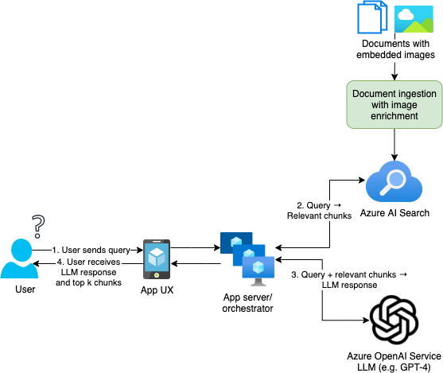

# RAG with Vision Application Framework

## Features

This repository provides an application framework for a Python-based [retrieval-augmented generation (RAG)](https://learn.microsoft.com/en-us/azure/search/retrieval-augmented-generation-overview) pipeline that can utilize both textual and image content from MHTML documents to answer user queries, leveraging Azure AI Services, Azure AI Search, and Azure OpenAI Service.
The project framework provides the following features:

- **Ingestion flow**: Ingests MHTML files into Azure AI Search using a newly developed enrichment pipeline.
- **Enrichment flow**: Enhances ingested documents by classifying images based on their content, using a multi-modal LLM (MLLM) to generate image descriptions, and caching enrichment results to speed up the process.
- **RAG with vision pipeline** : Utilizes enrichment data to search for images and incorporates the enrichment pipeline during inference.
- **Evaluation starter code**: Assesses the performance of a particular RAG pipeline configuration using various metrics, including ROUGE recall and LLM-as-a-judge techniques.

This repo is intended to be a starting point for RAG with vision, with the aim of enabling further experimentation to fine-tune the pipeline and best meet user needs for a given dataset.

## Getting Started

### Prerequisites and running the API

For more information on the prerequisites and how to run the RAG with Vision API locally, see [here](src/api/README.md).

This repository also includes a [devcontainer](.devcontainer/devcontainer.json) that can be used in VSCode with the `ms-vscode-remote.remote-containers` extension.

### Understanding the architecture

The overall inference flow can be described via the following diagram:

For a full overview of the RAG with Vision architecture, including the document ingestion process and the image enrichment service, see [this architecture document](docs/vision-rag-architecture.md).
An introduction to RAG pipeline evaluation and the starter evaluation flows provided in this repo, along with suggestions for collecting inner- and outer-loop feedback, can be found [here](docs/evaluation.md).
