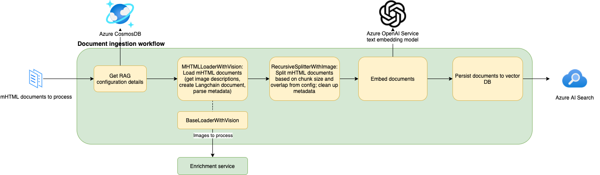

# Architecture: Vision RAG

- [Architecture: Vision RAG](#architecture-vision-rag)
  - [Problem statement](#problem-statement)
    - [Considerations](#considerations)
  - [System architecture](#system-architecture)
    - [Enrichment workflow](#enrichment-workflow)
    - [RAG Config Sample](#rag-config-sample)
      - [Multimodal LLM](#multimodal-llm)
      - [Classifier](#classifier)
      - [Caching](#caching)
    - [Document ingestion workflow](#document-ingestion-workflow)
      - [Document loader](#document-loader)
        - [Document loader configuration](#document-loader-configuration)
        - [Image annotation format](#image-annotation-format)
      - [Document splitter](#document-splitter)
        - [Document splitter configuration](#document-splitter-configuration)
    - [Inference workflow](#inference-workflow)
    - [API Endpoints](#api-endpoints)
      - [Upload documents (POST /upload)](#upload-documents-post-upload)
        - [Upload documents endpoint input](#upload-documents-endpoint-input)
        - [Upload documents endpoint output](#upload-documents-endpoint-output)
      - [Search (POST /search)](#search-post-search)
        - [Search endpoint input](#search-endpoint-input)
        - [Search endpoint output](#search-endpoint-output)
      - [Chat (POST /chat)](#chat-post-chat)
        - [Chat endpoint input](#chat-endpoint-input)
        - [Chat endpoint output](#chat-endpoint-output)
      - [Media Enrichment (POST /enrichment-services/media-enrichment)](#media-enrichment-post-enrichment-servicesmedia-enrichment)
        - [Input parameters](#input-parameters)
        - [Input sample](#input-sample)
        - [Output parameters](#output-parameters)
        - [Output sample](#output-sample)

## Problem statement

The [Retrieval-Augmented Generation architecture](https://learn.microsoft.com/en-us/azure/search/retrieval-augmented-generation-overview) has become more common with the advent of more mature generative AI models, giving users a way to ground LLM responses in data retrieved from some document store, typically a vector database.
The classic version of the pattern assumes text-only content in the document store;
however, in many enterprise scenarios, the content that users wish to query can contain images and tables that are also essential to accurately answering their questions that wouldn't normally be captured by a text-only document ingestion flow.

To address this use case, it makes sense to incorporate a **multimodal LLM**, such as [GPT-4V](https://techcommunity.microsoft.com/t5/ai-azure-ai-services-blog/gpt-4-turbo-with-vision-on-azure-openai-service/ba-p/3979933) or [GPT-4o](https://azure.microsoft.com/en-us/blog/introducing-gpt-4o-openais-new-flagship-multimodal-model-now-in-preview-on-azure/), into our RAG workflow.

This document provides an overview of the sample architecture presented in this repo

### Considerations

- Cost and latency
  - At the time of development, GPT-4V was the only multimodal LLM available via Azure OpenAI, and latency/cost were high enough based on expected load on the system that we felt it would be better to explore the pattern of generating and querying text descriptions of images as opposed to direct inference against a multimodal LLM.
  However, as the technology develops, newer multimodal models may be released with cheaper pricing and lower latency, which may make the direct inference architecture more viable.
  - not all images in documents are relevant or contain useful information (e.g. business logo letterhead, etc.) - we propose using a classifier to identify images for which using the enrichment service to generate an image description would have most value
- MHTML document format - for our use case, the document store we were considering was primarily HTML documents. HTML static content doesn't preserve the image data in the document, so we chose to convert the documents to MHTML format to ensure all required content was captured from the documents.

## System architecture

### Enrichment workflow

Enrichment is a service integrated with Azure AI Services, including Computer Vision and OpenAI Services. It has three main features: the multimodal LLM, the image classifier, and the enrichment cache.


### RAG Config Sample

RAG config sample that uses all the enrichment features:

```json
    "media_enrichment": {
        "features": {
            "mllm": {
                "enabled": true,
                "prompt": "Be a helpful assistant and answer anything!",
                "llm_kwargs": {},
                "model": "gpt-4o",
                "detail_mode": "auto"
            },
            "classifier": {
                "enabled": true,
                "threshold": 0.8
            },
            "cache": {
                "enabled": true,
                "expiry": null,
                "key_format": "2024-07-22-{hash}"
            }
        }
    }
```

#### Multimodal LLM

The multimodal LLM is a large language model with additional vision features to understand the content of images.
Examples of such models are GPT-4v or GPT-4o, which need to be specified in the `model` field.

The MLLM also requires a `prompt`, which is specific for image summarization and different from the one used at inference time.

You can complement other LLM arguments by using `llm_kwargs`, such as temperature or max tokens.

#### Classifier

The classifier helps reducing the number of calls made to GPT Vision, thereby decreasing latency and costs.

The classifier analyzes images using Azure Computer Vision Tags to categorize them based on their content.
It follows a set of rules to determine the appropriate action for each image:

- Ignore Category: If the image does not contain any tags or text, or if the image is a logo, it is categorized as "IGNORE".
  These images are considered irrelevant for further processing.

- GPT Vision Category: If the image contains text and keywords related to diagrams, designs, software, or websites, it is categorized as "GPT VISION".
  These images are suitable for further processing with GPT Vision to extract additional information.

The classifier requires a `threshold`, which represents the confidence score we want to consider for the provided tags.
By setting a specific threshold, we filter out tags with confidence scores below that level, ensuring that only reliable predictions are retained.
The value can range between 0 and 1.

#### Caching

Enrichment is a cost-full operation and it is important to avoid redundant calls to the Enrichment Service.

GPT Vision has three modes for its detail level: `low`, `high`, and `auto` (default).
The cost of the service is different for each mode. For `low` mode, the cost of the service is 85 tokens per image regardless what is the image resolution.
For the `high` resolution mode, it depends on the size of image.
For example, if the image size is 4096 x 8192, the cost will be 1105 tokens.
In this mode, GPT uses a hierarchical bird approach to adjust the image resolution and tile it for a better detailed output.
The images with resolution higher than 512 x 512 are considered high resolution images.

In terms of latency, it depends on the size and resolution of images and the number of services that are being called, the latency of the service can be high from 6s to 1 min.
For example, the latency of the service for a 4096 x 8192 image can be up to one minute.
It means ingestion of a document with 10 images can take up to 10 minutes without parallelization.

To avoid redundant calls in the Enrichment Service to underlying services including GPT and image analysis services, a cache can be used to store the results of the enrichment service to reduce the cost (almost zero if the result is cached for all consequent enrichment calls and Azure Cosmos DB used as a cache) and latency of the service.

The cache uses Azure Cosmos Db for caching the results of the Enrichment Service.

The cache will be a key/value store with an expiry date that will be refreshed anytime that the key is accessed.
The key will be generated from the input of the enrichment service and the value will be the result of the enrichment service.
The expiry date will be set based on the configuration of the enrichment service.
For example, the request will be with an additional field named `expiry` in the time span format as below:

```json
    "cache": {
        "enabled": true,
        "expiry": "DD:HH:MM:SS",
        "key_format": "{hash}",
    },
```

- Key: It will be generated from the input of the Enrichment Service using SHA-256 algorithm in the format `{domain}-{version}-{hash of the images and features}`.
  This format ensures that any change in the content of the image or the settings in `features`, including prompt and enhancement flags, will generate a new key/value. The old key/value will be expired based on the expiry date.

- Value: It will be the result of the Enrichment Service, including the Computer Vision and OpenAI services.

- Eviction Policy: It will be set based on the expiry date of the key/value.
  The expiry date will be refreshed anytime the key is accessed.
  In Azure Cosmos DB, the expiry date needs to be updated manually in the application code using the TTL feature of Azure Cosmos DB or by using a custom field for the `expiry` and an `index` on this field in the document.

### Document ingestion workflow



#### Document loader

The MHTML loader is designed to process a specified MHTML file, producing a sequence of Langchain document(s) based on the loader parameters available in the config JSON file.
It utilizes [the enrichment service](#enrichment-workflow) to retrieve descriptions for images contained in the file, if the necessary enrichment configuration is enabled, and insert those descriptions into the document using the [Markdown image annotation format](#image-annotation-format).
The content is maintained in text format, leveraging the BeautifulSoup and quopri libraries for accurate preservation.
The extracted document-level metadata includes the HTML file source information, `X-Metadata` header information, and image collection information if the enrichment service is enabled.

Note that the `MHTMLLoaderWithVision` class inherits from the `BaseLoaderWithVision` class;
the `BaseLoaderWithVision` class contains the logic for leveraging the enrichment service, and can be extended for future use for processing files in other document formats that contain image information, using the `MHTMLLoaderWithVision` implementation as a guide.

##### Document loader configuration

There's one main configurable flag in the document loader configuration:

- `separate_docs_for_images`: This flag should be set to `true` to separate out each image annotation in the MHTML file into its own separate document. When set to `false`, the image annotations would be kept inline at their location in the text.

Also note that the `media_enrichment` configuration section would also need to be specified in the JSON config file for the loader to process documents using the enrichment service.
If it's left unspecified or set to `None`, then the loader functionality will be very similar to what's provided by the Langchain `MHTMLLoader` out of the box, with the exception of the custom metadata processing included in the `MHTMLLoaderWithVision` class.

##### Image annotation format

As discussed above, the purpose of the custom vision loader is to replace all image content in an MHTML document with an image annotation tag consisting of the image description and URL, which can then be used to answer user queries and provide related image citations as part of LLM responses.
The format of the image annotation follows the standard Markdown image link format:

```md

```

#### Document splitter

The custom text splitter `RecursiveSplitterWithImage` is designed to process a specified text document generated using the [`MHTMLLoaderWithVision`](#document-loader), with the goal of producing a sequence of chunks for that document based on the splitter configuration.

One problem that arises during the splitting process is the potential loss of context for images.
This issue becomes evident when using the traditional LangChain [`RecursiveCharacterTextSplitter`](https://python.langchain.com/docs/modules/data_connection/document_transformers/recursive_text_splitter), as the image description can be split across different chunks which means they might lose the url reference if it is present only in the content.
The design assumes image annotations are specified in the text document using the image markdown format ``````.
Other image formats, such as `(URL)`, will be ignored by the splitter.

The implemented solution enhances the functionality of the `RecursiveCharacterTextSplitter` to handle the context of images when splitting the text into multiple chunks.
This involves iterating across all chunks for a document, using the image annotation position information included from the loader pre-processing to determine whether an image annotation has been broken up between multiple chunks.
If this custom splitter finds that an annotation has been broken with the image description split between chunks, it ensures that it is in the correct format - that the image description component of the chunk is enclosed in `![` and `]` and that the correct image URL is propagated across all chunks of the broken image annotation.

##### Document splitter configuration

The splitter depends on the below configuration to generate the relevant chunks along with its metadata:

- `image_collection_in_metadata`: Enable this flag if you intend to make the image collection fields searchable for a given index definition.
  When set to true, the image URLs and descriptions are stored as metadata within the content document.
- `chunk_size`: desired chunk size when splitting the document.
  Note that the result may not exactly conform to this due to the `RecursiveSplitterWithImage` calling `RecursiveCharacterTextSplitter.split_documents()` with `_separators = ["\n\n", "\n", " "]`, not including the default `""` so as to not split image URLs.
- `chunk_overlap`: desired chunk overlap when splitting the document.

### Inference workflow


The above diagram is adapted from the [Azure documentation on on retrieval-augmented generation (RAG)](https://learn.microsoft.com/en-us/azure/search/retrieval-augmented-generation-overview).

### API Endpoints

#### Upload documents (POST /upload)

##### Upload documents endpoint input

The `/upload` endpoint requires the following fields in the input body:

- `files`: The list of MHTML documents to upload via the [document ingestion process](#document-ingestion-workflow) described above.
- `rag_config`: The configuration ID used for this RAG pipeline - a sample of the full configuration file (of which the ID is the first field) can be seen [here](src/api/rag_configs/sample.json).

##### Upload documents endpoint output

On success, this endpoint returns HTTP status `204 No Content`.

#### Search (POST /search)

##### Search endpoint input

The `/search` endpoint requires the following fields in the input body:

- `rag_config`: The configuration ID used for this RAG pipeline - a sample of the full configuration file (of which the ID is the first field) can be seen [here](src/api/rag_configs/sample.json).
- `query`: The user query that will be used as [input for the RAG pipeline](#inference-workflow)

###### Search endpoint input sample

```json
{
  "rag_config": "sample",
  "query": "What's the meaning of life?"
}
```

##### Search endpoint output

The output of the `/search` endpoint is a list of JSON objects representing the top `k` (as specified in the JSON config file) chunks retrieved from the vector database from the documents previously ingested based on the specified RAG config, given a particular user query.

###### Search endpoint output sample

```json
[
  {
    "page_content": "sample page content",
    "metadata": {
      "source": "/workspaces/experiment-framework-for-rag-apps/src/api/temp/sample/tmpuexquqv2/tmpyizwptw8"
    },
    "type": "Document"
  },
  ...
]
```

#### Chat (POST /chat)

##### Chat endpoint input

The `/chat` endpoint requires the following fields in the input body:

- `rag_config`: The configuration ID used for this RAG pipeline - a sample of the full configuration file (of which the ID is the first field) can be seen [here](src/api/rag_configs/sample.json).
- `query`: The user query that will be used as [input for the RAG pipeline](#inference-workflow)

###### Chat endpoint input sample

```json
{
  "rag_config": "sample",
  "query": "What's the meaning of life?"
}
```

##### Chat endpoint output

The output of the `/chat` endpoint is just a string of the LLM response to the user query, based on the documents previously ingested for the specified `rag_config`, following the inference workflow described [above](#inference-workflow).

#### Media Enrichment (POST /enrichment-services/media-enrichment)

##### Input parameters

This endpoint accepts the following parameters to enrich images:

- `domain`: The domain for which enrichment is requested.
- `config_version`: The version of the configuration to be used.
- `images` (up to 10): A list of image files to be processed by CHATGPT4 Vision. Classifier only considers the first image as it will be used only during ingestion.
- `features`: it will be a set of features including gpt4v, classifier and caching.
  - `cache`
    - `enabled`: A boolean flag indicating whether caching should be enabled.
    - `key_format`: a string to format the generated keys using domain, config version and hash of the images and feature collection. For example, key_format can be set to `'{domain}-{config_version}-{hash}'`.
    - `expiry`: a string in the format of `dd:HH:mm:ss` to provide an expiry time span in the document level. If it is not provided as a part of the request, the cached item will be expired based on the time specified in the index collection level.
  - `classifier`:
    - `enabled`: A boolean flag indicating whether the classifier should be used. Will be true for ingestion only for now.
    - `threshold`: The threshold value represents the confidence score that we want to consider for the provided tags. By setting a specific threshold, we filter out tags with confidence scores below that level, ensuring that only reliable predictions are retained. The value ranges between 0 and 1.
  - `mllm`:
    - `enabled`: A boolean flag indicating whether GPT-4 variant is enabled.
    - `prompt`: The system message prompt to be used.
    - `detail_mode`: it canbe set to `low`, `high` and `auto` by default. If you have any high resolution images (any image with any dimension higher than 512) and set the detail mode to `auto` or `high`, the cost and latency will be higher but gpt4v will provide a more detailed information.
    - `llm_kwargs`:
      - `temperature`: The temperature parameter for language model generation.
      - `max_tokens`: The maximum number of tokens for language model output.

##### Input sample

```json
{
  "domain": "string",
  "config_version": "string",
  "images": [
    "string"
  ],
  "features": {
    "cache": {
      "enabled": true
    },
    "classifier": {
      "enabled": true,
      "threshold": 0
    },
    "mllm": {
      "enabled": true,
      "prompt": "string",
      "llm_kwargs": {
        "temperature": 0,
        "max_tokens": 3000,
          "enhancements": {
            "ocr": {
              "enabled": false
            },
            "grounding": {
              "enabled": false
            }
          }
      }
    }
  }
}
```

##### Output parameters

The response from the endpoint is a `JSON` object that has the following format -

- `classifier_result`: The category to which the first image is classified (if classifier is enabled). Otherwise, it will be None. If the category is "GPT VISION", then image description would be extracted.
- `generated_response`: Text describing the image (if extracted using ChatGPT4 Vision model).

##### Output sample

```json
{
"generated_response": {
    "content": "This image shows a collage of five men, each dressed in different styles of formal attire. From left to right:\n\n1. The first man is wearing a dark blue, polka-dotted suit with a white shirt and a dark tie. He is also wearing black dress shoes.\n\n2. The second man is dressed in a teal blue suit with a matching shirt and no tie. He has brown dress shoes.\n\n3. The third man is wearing a light grey, three-piece suit with a white shirt, a light grey vest, a dark tie, and a white pocket square. He is also wearing black dress shoes.\n\n4. The fourth man is in a black leather bomber jacket with red and green stripes on the cuffs, paired with black pants and black sneakers.\n\n5. The fifth man is wearing a black double-breasted suit with a black shirt and no tie. He has a tattoo on his right hand and is wearing black dress shoes.\n\nAll faces have been blurred out, making it impossible to identify the individuals."
  },
  "classifier_result": "GPT_VISION"
}
```

Limitations of current enrichment service implementation

1. **Image Enhancement Limitation**: During a chat session, enhancements can only be applied to a single image. Multiple images cannot be enhanced within a single chat call.
1. **Maximum Input Image Size**: The largest allowable input image size is 20 MB.
1. **Object Grounding in Enhancement API**: When using the enhancement API for object grounding, if duplicate objects are detected, a single bounding box and label will be generated for all duplicates, rather than separate ones for each.
1. **Image Chat Restriction**: When uploading images in Azure OpenAI Studio or the API, there is a limit of 10 images per chat call. then image description would be extracted.
